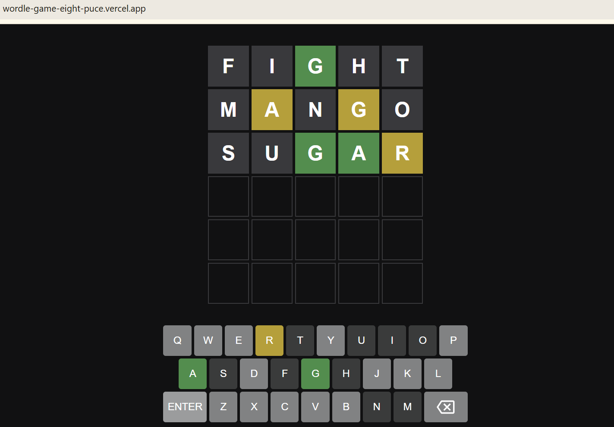

A simple, browser-based game which is clone of the popular word-guessing game Wordle, built with vanilla HTML, CSS, and JavaScript.



## How to Play

The goal is to guess a secret 5-letter word in six tries.

1.  Type a 5-letter word using either your physical keyboard or the on-screen keyboard, and press Enter.
2.  The tiles for each letter will change color to provide clues:
    * **🟩 Green:** The letter is in the word and in the correct position.
    * **🟨 Yellow:** The letter is in the word but in the wrong position.
    * **⬜ Gray:** The letter is not in the word at all.
3.  Use these clues to make your next guess.
4.  You win if you guess the word correctly within six tries!

## Features

* **Classic Gameplay:** 5-letter words, 6 guesses.
* **Word Validation:** The game checks your guess against a large dictionary to ensure it's a valid word.
* **Dual Keyboard Support:** Play using either the on-screen keyboard or your physical keyboard.
* **Visual Feedback:** The on-screen keyboard keys change color to match your guesses.
* **Sleek Animations:**
    * **Flip:** Tiles flip over to reveal their status.
    * **Shake:** The row shakes on an invalid guess (e.g., not in word list).
    * **Dance:** Tiles do a "dance" animation when you win.
* **Alerts:** Get on-screen alerts for wins, losses, and invalid words.
* **Dark Mode UI:** Easy on the eyes with a clean, dark theme.

## Technologies Used

* **HTML5:** For the structure of the game.
* **CSS3:** For all styling, grid layout, and animations.
* **Vanilla JavaScript:** For all game logic, event handling, and DOM manipulation.

## How to Run Locally

Because this project uses the `fetch()` API in JavaScript to load the word lists (`dictionary.json`, `target-words.json`), it must be run on a local server. Opening the `index.html` file directly in your browser will result in a CORS error.

1.  **Clone the repository:**
    ```sh
    git clone [https://github.com/S4srihari/Wordle-game.git](https://github.com/S4srihari/Wordle-game.git)
    ```
2.  **Navigate to the project directory:**
    ```sh
    cd Wordle-game
    ```
3.  **Start a simple local server.** A quick way to do this is with Python:

    *If you have Python 3:*
    ```sh
    python -m http.server
    ```
    *If you have Python 2:*
    ```sh
    python -m SimpleHTTPServer
    ```
    (You can also use other tools like the "Live Server" extension in VS Code).

4.  **Open the game in your browser:**
    Go to `http://localhost:8000` (or the port specified by your server).
    